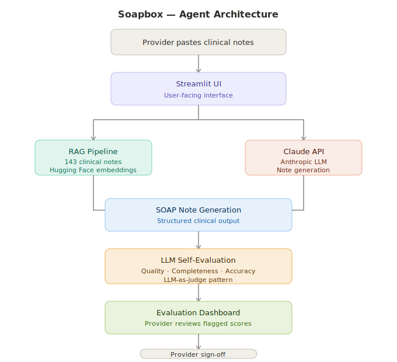

# Soapbox — Clinical AI Scribe Agent

> Automating clinical documentation so providers can focus on what matters most: their patients.

---

## The Problem

Physicians spend an average of **2+ hours on documentation for every hour of patient care**. For a practice seeing 65+ patients a day, that's an unsustainable administrative burden — and it directly impacts the quality of care.

Soapbox is built to fix that.

---

## What It Does

Soapbox is an AI-powered clinical scribe that converts provider transcriptions into structured, reviewable SOAP notes — with built-in LLM evaluation to validate quality, completeness, and clinical accuracy before sign-off.

**Workflow:**
1. Provider pastes transcribed clinical notes into the app
2. A RAG pipeline retrieves relevant context from 143 clinical notes
3. Claude API converts the transcription into a structured SOAP note
4. A second LLM call (LLM-as-judge) evaluates the note on quality, completeness, and accuracy
5. Scores are displayed on a real-time dashboard — provider reviews any flagged areas and signs off

---

## Architecture

---

## Tech Stack

| Layer | Technology |
|---|---|
| Frontend | Streamlit |
| LLM | Claude API (Anthropic) |
| Retrieval | RAG Pipeline — 143 clinical notes |
| Embeddings | Hugging Face |
| Language | Python |

---

## Key Features

- **SOAP note generation** from pasted clinical transcriptions
- **RAG-grounded responses** using a real clinical note corpus — reduces hallucination and improves clinical relevance
- **LLM-as-judge evaluation** — a second model call scores the generated note on quality, completeness, and accuracy
- **Real-time evaluation dashboard** — providers see scores at a glance and know exactly what to review
- **Clean provider-facing UI** built with Streamlit

---

## Projected Impact

For a practice seeing **65+ patients per day:**

| Metric | Without Soapbox | With Soapbox |
|---|---|---|
| Documentation per patient | ~15–20 min | ~2–3 min (review only) |
| Daily documentation time | ~16 hrs | ~2 hrs |
| Time saved per day | — | **~14 hours** |

That's 14 hours returned to direct patient care — every single day.

---

## What's Next

- **Direct audio input** — integrate speech-to-text so providers can speak directly into the app, eliminating the paste step entirely and creating a fully automated transcription-to-SOAP workflow
- **EHR integration** — connect directly with EPIC or other EHR systems to pull patient context automatically and push finalized notes back without manual entry
- **Multi-provider support** — extend the app to support multiple providers with role-based access and note history
- **Fine-tuned evaluation model** — replace the general-purpose LLM evaluator with a model fine-tuned specifically on clinical documentation standards (e.g. trained on SOAP note rubrics used in medical education)
- **Latency optimization** — parallelize the RAG retrieval and generation steps to reduce end-to-end response time for high-volume practices
