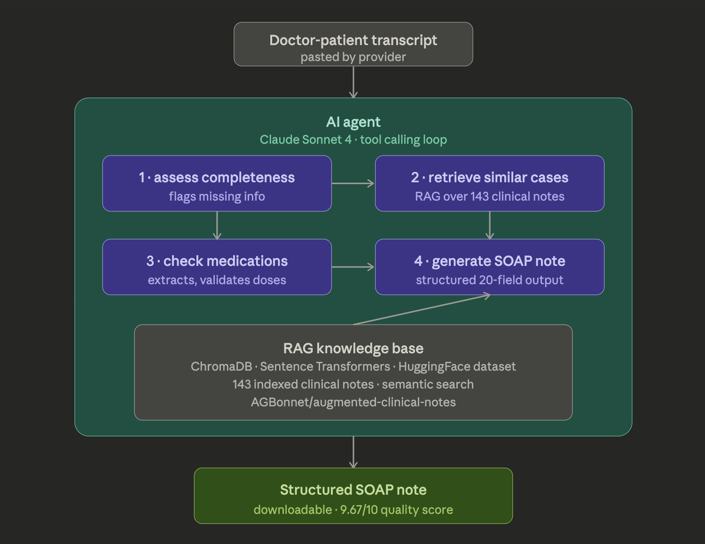

# SoapBox — AI Clinical Scribe Agent

Converts doctor-patient transcripts into structured SOAP notes
using an agentic RAG pipeline.


---

## Demo
[Live Demo](#) · [LinkedIn Post](#)

---

## What it does
Physicians spend nearly 2 hours on documentation for every 1 hour
of patient care. SoapBox automates the most time-consuming part —
turning raw visit transcripts into structured, billable SOAP notes
in seconds.

---

## Architecture


---

## Evaluation Results

| Metric | Score |
|---|---|
| LLM Quality Score | 9.67 / 10 |
| Semantic Similarity | 0.81 |
| Field Coverage | 100% |
| Cases Evaluated | 3 / 3 |

---

## Tech Stack
- Claude Sonnet 4 — LLM + tool calling
- ChromaDB — vector database
- Sentence Transformers — embeddings
- HuggingFace Datasets — clinical notes corpus
- Streamlit — frontend

---

## Run Locally
```bash
git clone https://github.com/Sadhanha/SoapBox.git
cd SoapBox
python -m venv venv && source venv/bin/activate
pip install -r requirements.txt
echo "ANTHROPIC_API_KEY=your_key" > .env
python vector_store.py
streamlit run app.py
```

---

## Run Evaluation
```bash
python evaluate.py
```

---

## Project Structure
```
├── app.py             # Streamlit UI
├── agent.py           # Agent loop + tools
├── vector_store.py    # ChromaDB + RAG
├── soap_generator.py  # SOAP generation
├── evaluate.py        # Evaluation framework
└── requirements.txt
```
